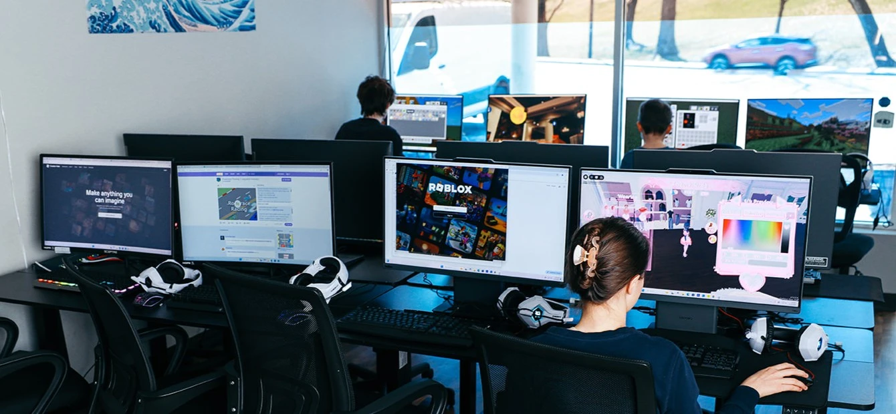
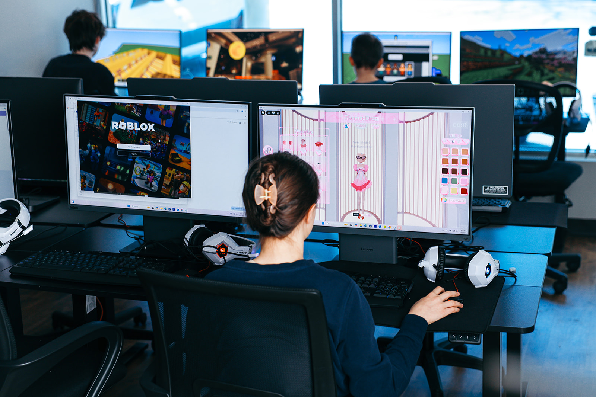

At Blue Ridge Boost, we turn your child's birthday into a tech-powered adventure with robotics and gaming fun!

<!---->
    <ul>
    <h3>Party Details</h3>
    <h5><strong>15 Guests + 1 Birthday Kid</strong></h5>
    <h5><strong>30 min of social time + 90 minutes of gaming or robotics activities</strong></h5>    
    <h5><strong>Available Times:</strong></h5> 
    <h6><li>Saturdays 4-6 PM</li>
    <li>Sundays 4-6 PM</li>
    <li>Other dates upon request in advance</li></h6>

<ul>
<h3>Party Types:</h3>
<h4><strong>Gaming Party</strong></h4>
<h6>16 Gaming Computers, all fully decked out with headphones, an RGB keyboard + mouse, touchscreen capablities, and pre-setup accounts for co-op play!</h6>
<h4><strong>Robotics Party</strong></h4>
<h6>Build, Test, Battle! Select the kind of robots you'd like at your party, and enjoy activities made just for that kind of robot. Building, battling, coding, driving, racing, flying- your child and their friends will have hands-on fun wroking with awesome robots!</h6>
<h4><strong>Combo Party (+$99.99)</strong></h4>
<h6>Combine gaming and robotics into one action-packed celebration! Select 1 video game theme and 1 robotics theme and split activity time between your choices!</h6>
</ul>

    <!--This needs to be in a row-->
    <h3>Step 1: Select an Awesome Theme</h3>
    <!--Make this a banner-->
    

        

            <h4>Gaming Themes</h4>
            <!--Subtitle Needed-->
            <body>Minecraft</body> 
            <h6>Rec. Ages: 6+</h6>
            <body>Roblox</body> 
            <h6>Rec. Ages: 8+</h6>
            <body>Fortnite</body>
            <h6>Rec. Ages: 10+</h6>
            <body>Call of Duty</body>
            <h6>Rec. Ages: 12+</h6>
            <body>Valorant</body>
            <h6>Rec. Ages: 12+</h6>
            <body>Other Games</body> 
            <h6>Upon Request</h6>
        

        

            <h4>Robotics Themes</h4>
            <body>Lego Robotics</body> 
            <h6>Rec. Ages: 6+</h6>
            <body>Sphero Bots</body> 
            <h6>Rec. Ages: 6+</h6>
            <body>Lego Robotics: Spike Prime</body>
            <h6>Rec. Ages: 10+</h6>
            <body>Sumo Bots</body> 
            <h6>Rec. Ages: 8+</h6>
            <body>Aerial Drones</body> 
            <h6>Rec. Ages: 10+</h6>
        

    

        <h3>Step 2: Select Party Bundle</h3>
        

        

        <ul>
            <h4>Party Pricing</h4>
            <h5>Basic Party: $349</h5>
            <h5>Includes:</h5>
            <ul>
                <h6>
                <li>90 minutes of gaming or robot building</li>
                <li>30 minutes of social time to eat</li>
                <li>15 guests + 1 birthday kid (16 total)</li>
                </h6>
            </ul>
            </ul>
        

        

            
        

    

    

        <h4>Party Bundles</h4>
    

    

        

            <!--super charged, gamer, pro, champion, vip-->
                <h4>Level-Up Party Package</h4>
                
Cost: $449 for up to 8 guests + $12 for each additional guest

                
Everything in the Basic Party Package plus:

                <ul>
                    <h5>
                    <li>Party Decorations</li>
                    <li>Cupcakes</li>
                    <li>Papa John's Pizza</li>
                    <li>Soda</li>
                    <li>Plates, Cups, Napkins, Cutlery</li>
                    </h5>
                </ul>
        

        

                <h4>&#127812 Power-Up Party Package</h4>
                
Cost: $499 for up to 8 guests + $14 for each additional guest

                <ul>
Everything in the Level-Up Package plus:

                    <h5>
                    <li><strong>Themed</strong> Decorations, Plates, Cups, Napkins</li>
                    <li>Balloons</li>
                    <li>A choice of Cake or Cupcakes</li>
                    <li>A choice of Fruit Juice or Lemonade</li>
                    <li>16 Goodie Bags</li>
                    </h5>
                </ul> 
        

        

                <h4>&#127775 Super-Star Ultimate Party Package (+$199.99 for up to 8 guests + $16 for each additional guest)</h4>
                
Cost: $599 for up to 8 guests + $19 for each additional guest

                <ul>
Everything in the Power-Up Package plus:

                    <h5>
                    <li>A choice of gourmet pizza or sushi platter.</li>
                    <li><strong>Organic</strong> Fruit Juice</li>
                    <li><strong>Organic</strong> Fruit Platter<li>
                    <strong><li>Personalized Digital Invitation</li>
                    <li>+1 additional hour of play</li></strong>
                    </h5>
                </ul>
        

    

    

    <!-- 

    
 -->
    

    <h3>Step 3: Get the party started!</h3>
    <h5>Select and reserve a party slot, using the calander below. Please fill out all the information fields so we can start planning your tech-tastic party!</h5>
    <h6> Note: There is a deposit fee to reserve a party date. The deposit is NOT an addition cost, and will contribute towards the total payment for your party! </h6>
    <!--I would like to make this an "email us" button later on-->
    <ul>
    <!-- 

 -->
    <!-- add a la carte add ons of baloons and maybe pizza -->
    <!-- add embeded deposit system -->
    
    <h5>If you have any questions, email <a href="mailto:lain@blueridgeboost.com">lain@blueridgeboost.com</a>!</h5>
    <h5>See you at the party!</h5>
    </ul>
    

