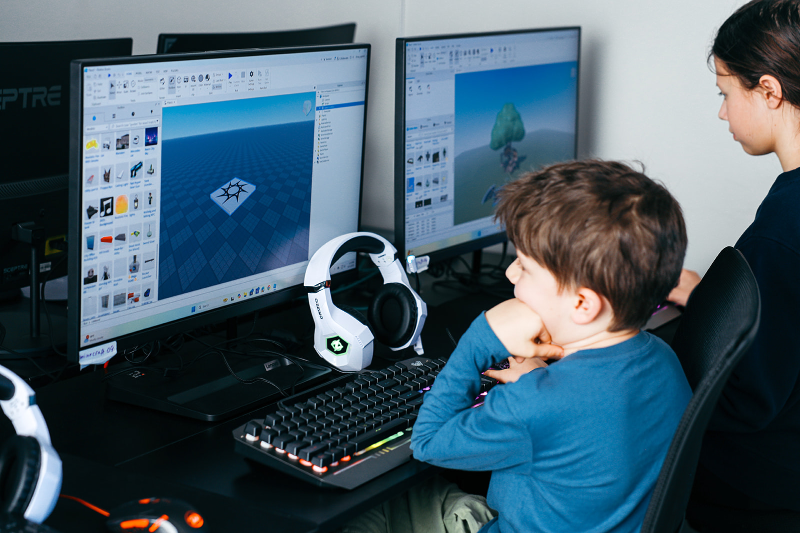

Group Classes, just for you! Our on‑demand Group Classes are designed to be flexible and tailored to your group—schedule between 9:00 AM and 3:00 PM, or later, to fit your day.

    

    
<!---->
    

    

        <ul>
        <h3>Perfect for</h3>
        <h5><li>Homeschool Groups</li>
        <li>Education Pods</li>
        <li>Series of Field Trips</li>
        <li>Study groups</li></h5>
        </ul>
    

    

    

        

                <h4>Math</h4>
                <ul>
                    <h5>
                    <li>Algebra 1</li>
                    <li>Geometry</li>
                    <li>Algebra 2</li>
                    <li>Pre-Calc</li>
                    <li>AP Statistics</li>
                    <li>AP Calculus</li>
                    <li>Challenge Math / Problem solving </li>
                    </h5>
                </ul>
        

        

                <h4>Computer Coding</h4>
                <ul>
                    <h5>
                    <li>Scratch Coding</li>
                    <li>Block Coding</li>
                    <li>Python</li>
                    <li>Java</li>
                    <li>JavaScript
                    <li>Web Design</li>
                    <li>Web Development</li>
                    <li>Unity</li> 
                    <li>Unreal Engine</li>
                    </h5>
                </ul>
        
  
        

                <h4>Robotics</h4>
                <ul>
                    <h5>
                    <li>LEGO Robotics</li>
                    <li>VEX Robotics</li>
                    <li>Sphero Robotics</li>
                    </h5>
                </ul>
        

    
  
<h4>Looking for something else? Other classes are available upon request! Let us know what topic you're interested in, and we will discuss ways to make your STEM dream a reality!</h4>

        

        

        <h3>The more the merrier!</h3>
        

        

        <ul>
            <h5>The more students you have in your class, the better the deal! </h5>
            <h5>This pricing sheet is based on a typical schedule of weekly 45-min classes</h5>
            </ul>
        

        

            
        

    

    <h4>Elementary / Middle School Levels (Grades 1 - 8)</h4>
    

        

                <h4>3 Students</h4>
                <ul>
                    <h5>
                    <li>Per Class: $53 per student</li>
                    <li>Monthly: $212 per student</li>
                    </h5>
                </ul>
        

        

                <h4>4-5 Students</h4>
                <ul>
                    <h5>
                    <li>Per Class: $40 per student</li>
                    <li>Monthly: $160 per student</li>
                    <li>Save 25%
                    </h5>
                </ul>
        

        

                <h4>6-7 Students</h4>
                <ul>
                    <h5>
                    <li>Per Class: $36 per student</li>
                    <li>Monthly: $144 per student</li>
                    <li>Save 32%</li>
                    </h5>
                </ul>
        
  
        

                <h4>8+ Students</h4>
                <ul>
                    <h5>
                    <li>Per Class: $32 per student</li>
                    <li>Monthly: $128 per student</li>
                    <li>Save 40%</li>
                    </h5>
                </ul>
        

    
  
    <h4>High School Levels (Grades 9 - 12)</h4>
    

        

            <!--super charged, gamer, pro, champion, vip-->
                <h4>3 Students</h4>
                <ul>
                    <h5>
                    <li>Per Class: $56 per student</li>
                    <li>Monthly: $224 per student</li>
                    </h5>
                </ul>
        

        

                <h4>4-5 Students</h4>
                <ul>
                    <h5>
                    <li>Per Class: $47 per student</li>
                    <li>Monthly: $188 per student</li>
                    <li>Save 16%</li>
                    </h5>
                </ul>
        

        

                <h4>6-7 Students</h4>
                <ul>
                    <h5>
                    <li>Per Class: $43 per student</li>
                    <li>Monthly: $172 per student</li>
                    <li>Save 23%</li>
                    </h5>
                </ul>
        
  
        

                <h4>8+ Students</h4>
                <ul>
                    <h5>
                    <li>Per Class: $37 per student</li>
                    <li>Monthly: $148 per student</li>
                    <li>Save 34%</li>
                    </h5>
                </ul>
        

    
  
    <h5>If you have any questions, or are interested in bringing your group to Blue Ridge Boost, email <a href="mailto:lain@blueridgeboost.com">lain@blueridgeboost.com</a>!</h5>
    <h5>We can't wait to make a course, just For You!</h5>
    </ul>
    

